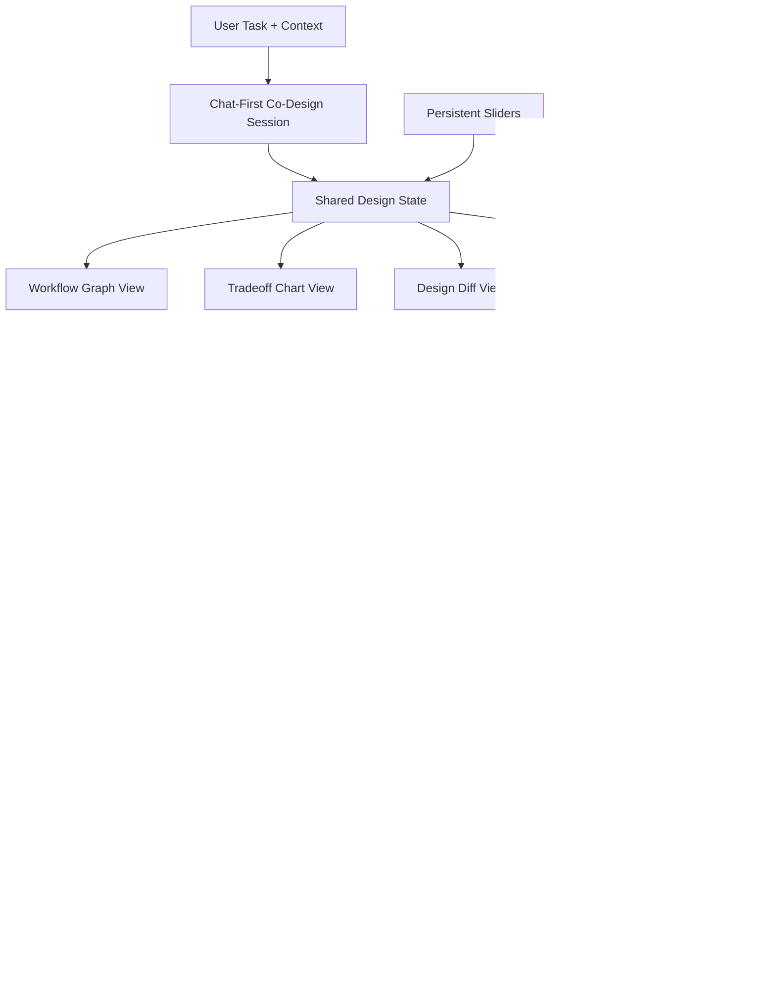
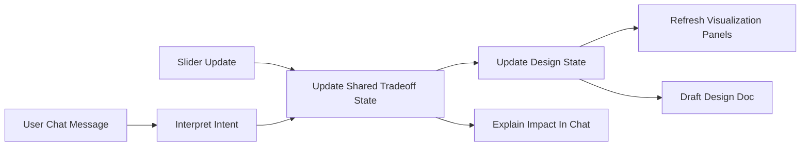
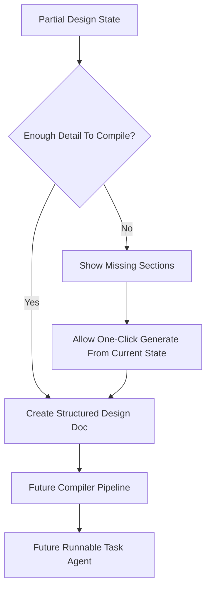
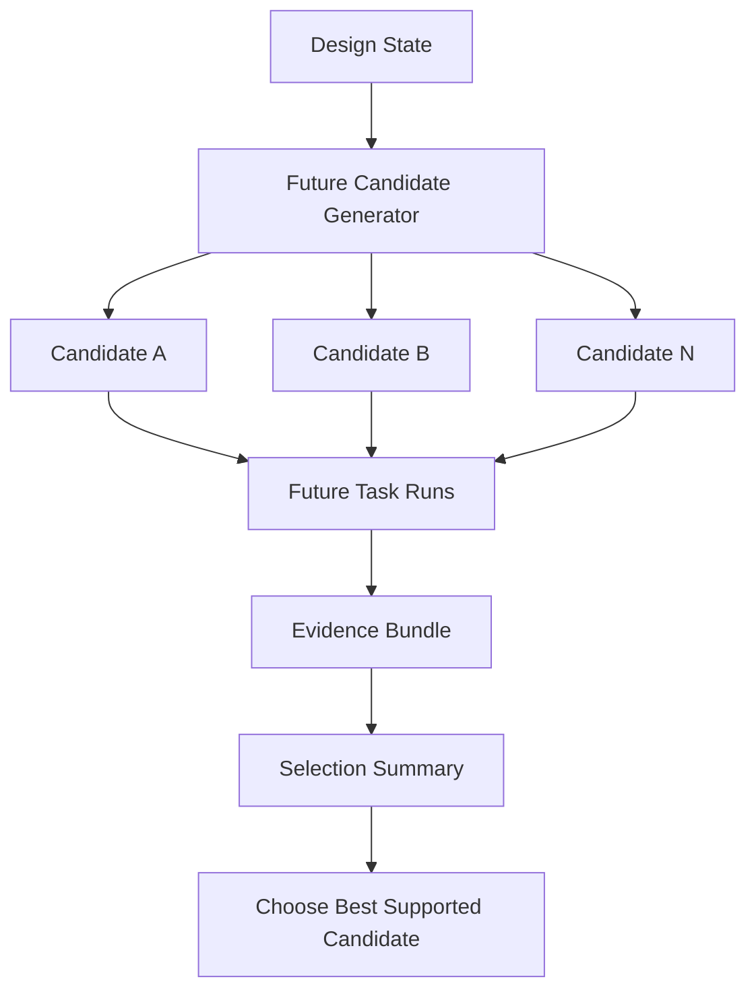
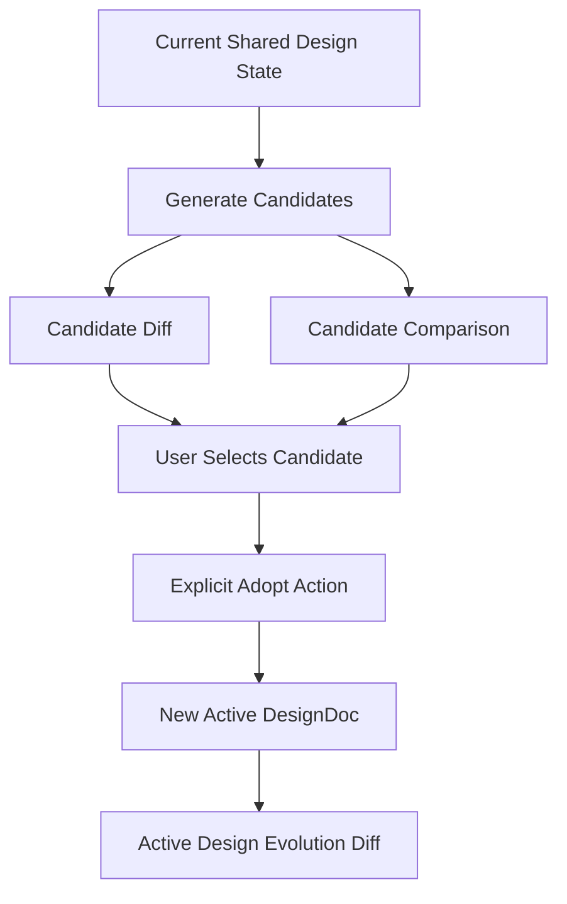
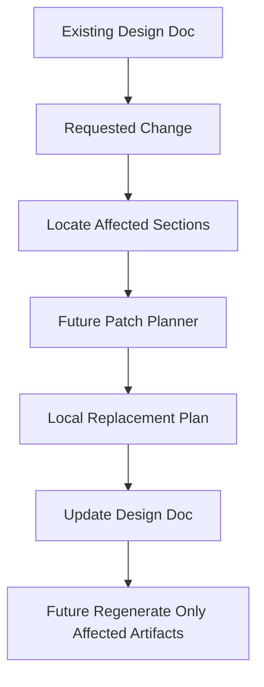

# Architecture

This document sketches the intended structure of Agent Design Studio. The diagrams below include both current foundation concepts and clearly marked future flows.

## End-to-End Workflow

## Chat + Slider Interaction

## Partial Design State To Compile (Future Flow)

## Candidate Evaluation / Selection (Future Flow)

## Candidate Inspection + Adoption

## Patch / Local Replacement (Future Flow)

